> Picture this: you're deep into your research project, analyzing years of valuable data. Suddenly, your system fails. Without regular backups, that mountain of critical data—essential for your groundbreaking research—could vanish in an instant, like sand slipping through your fingers. This isn’t just a minor setback; it’s a disaster scenario where lost data means lost time, funding, and possibly irreplaceable scientific insights. It's like building a house of cards only to watch it fall. Regular backups are your insurance policy against such catastrophes, ensuring that your hard work and important discoveries are preserved safely, no matter what happens. So, why risk it? Secure your data, secure your peace of mind.

## Mounting the lab backup storage
### Windows
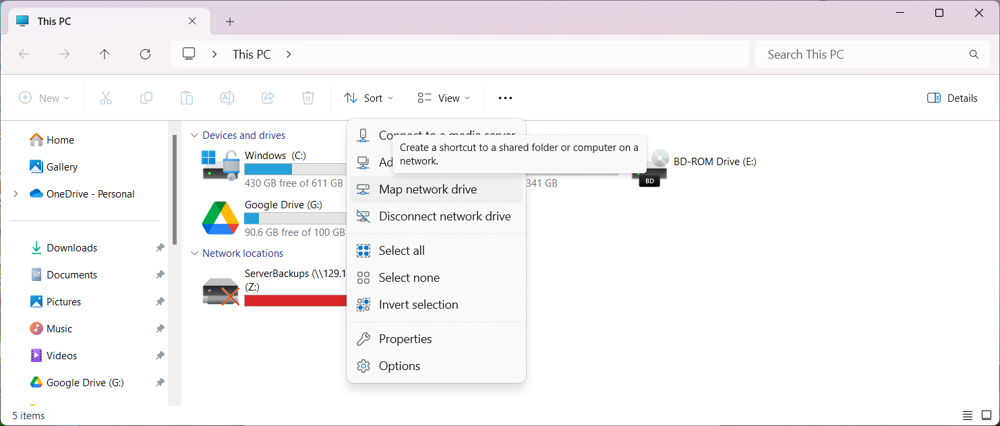

1. Open "This PC"
2. Click on the ellipsis button (...)
3. From the menu select "Map network drive" 

    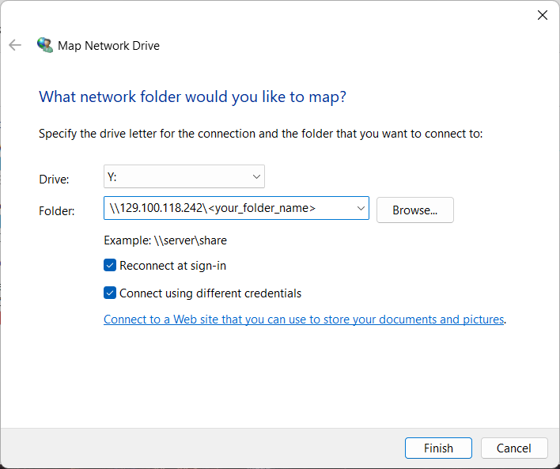

4. You'll see a window like above
5. Select an arbirtary drive for mounting the backup storage. It usually starts from the Z letter and if that is taken suggests the letter before that and so on.
6. Folder refers to the folder on the backup storage that you intend to access. Type the IP address for the storage and your folder name. For example: `\\129.100.118.242\Ali`
7. Make sure to check "Reconnect at sign-in" so the backup folder would be automatically mounted at start up.
8. Check "Connect using different credentials" since your credentials for the backup server would not be the same as your Western ID.
9. Click "Finish".

    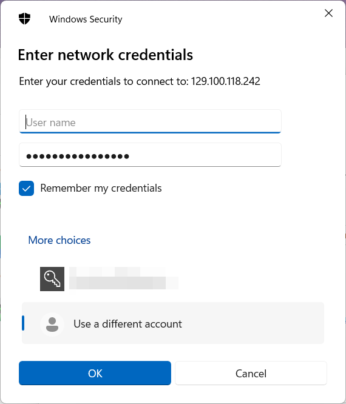

10. In the new popped-up window, click "More choices" select "Use a different account".
11. Enter your username and password for the backup server. 
12. Check "Remember my credentials".
13. Click "OK".
14. The backup folder should be mounted in the drive you specified.

### Mac
### Linux (Ubuntu)
To mount your folder on the backup storage using smb protocol follow the instructions below:

1. Make sure you have `cifs-utils` installed. If you don't, install it using `apt`: 
    ```
    sudo apt-get install cifs-utils
    ```
2. Create the mount directory: 
    ```
    sudo mkdir /mnt/backup
    ```
3. Open `/etc/fstab` with root privileges: 
    ```
    sudo nano /etc/fstab
    ```
4. Add the following lines to mount the storage automatically on system boot:
    ```
    # Mount lab backup storage
    //129.100.118.242/<your_folder_name> /mnt/backup cifs credentials=/home/<username>/.smbcredentials 0 0
    ```
    `<username>` is your local username.
5. Create `.smbcredentials` file in your home directory and enter your credentials for the backup server: 
    ```
    nano ~/.smbcredentials
    ```
    Then,
    ```
    username=<backup_server_username>
    password=<backup_server_password>
    domain=129.100.118.242
    ```
6. Save the file and exit.
7. Make sure to secure your `~/.smbcredentials` file: 
    ```
    chmod 600 ~/.smbcredentials
    ```
8. Test the mount:
    ```
    sudo mount -a
    ```

## Set-up a regular automatic backup policy
### Windows
There are diffrent ways to set-up an automatic backup in windows. Third-party softwares usually offer more options, flexibility, and controls on the backup policies you define. The ["EaseUS Todo Backup"](https://www.easeus.com/brand/todo-backup/tb-free.html) is a one of the options. The free version offers more than enough for our purposes. The following will go over instruction for setting up your automatic backup using EaseUS Todo Backup.

1. Download and install ["EaseUS Todo Backup"](https://www.easeus.com/brand/todo-backup/tb-free.html) from the provided link.
    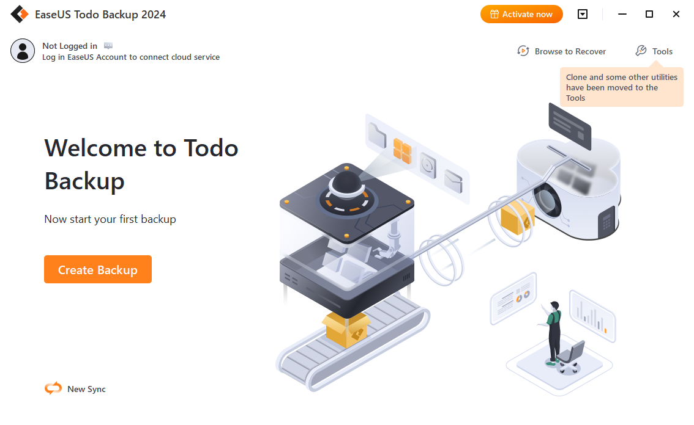
2. Click "Create Backup".
    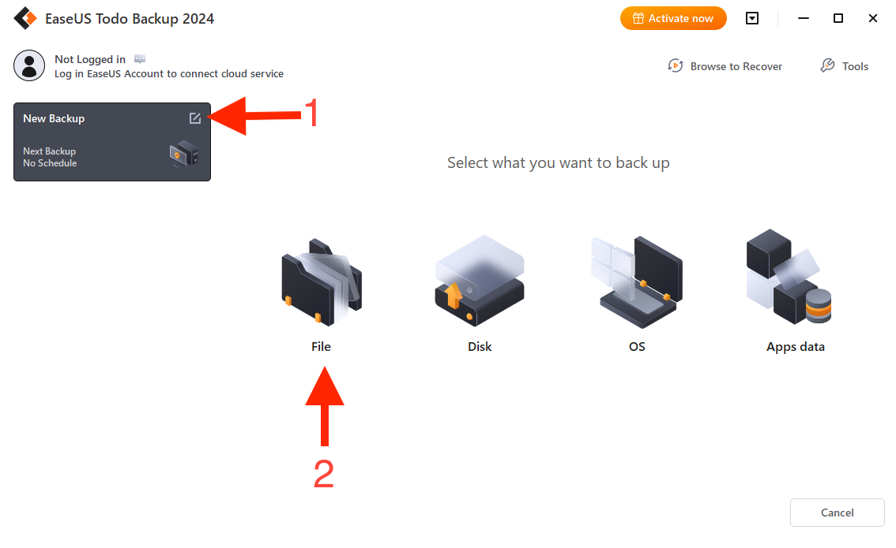
3. Click the edit icon on the top right corner of the backup plan (depicted in the picture above) and give it a name for your future reference.
4. Select the "File" option.
    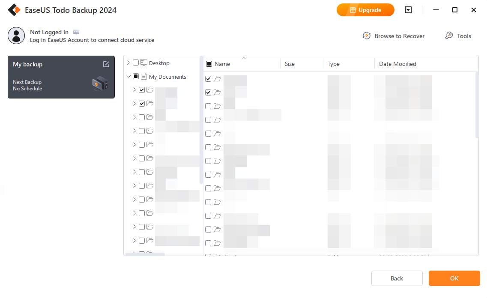
5. Select all files and folders that you wish to include in this backup plan. Then, click "OK" on the bottom right corner.
    > You can make other backup plans that differ in their frequency or other options discussed below.
    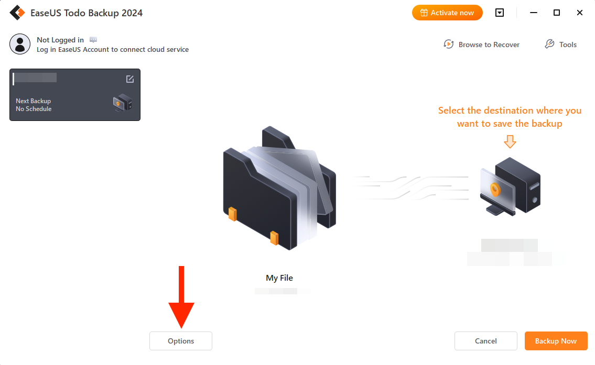
6. Click "Options" on the bottom of the window.
    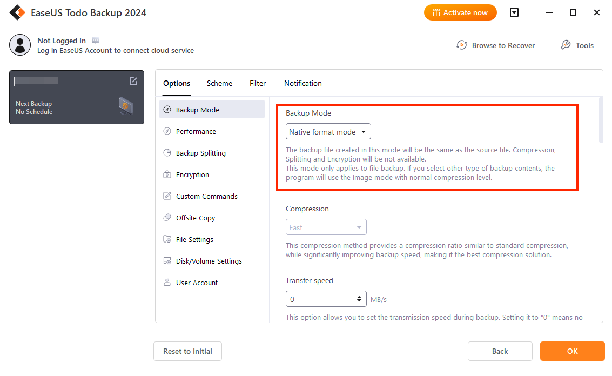
7. Under the Options tab, select "Backup Mode" item and change backup mode to "Native format mode". The backup mode is "Image mode" by default which can be compressed to save space on the backup storage. However, changing it to native mode (meaning keeping the files and directory structures as they are) is more readable and you will be able to partially restore your files easier.
    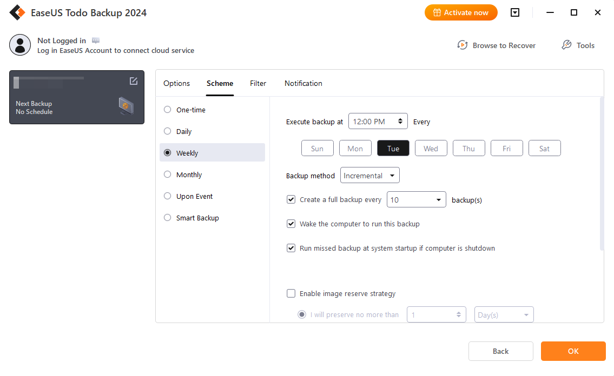
8. Under the Scheme tab, set the frequency of your backup rule. If you want some of your files to be backedup more/less frequently you can create other backup rules for those files. Make sure to set a backup at least once a week or more frequent.
9. (Optional) You browse other options like filter and notifications if you needed.
10. Click "OK".
    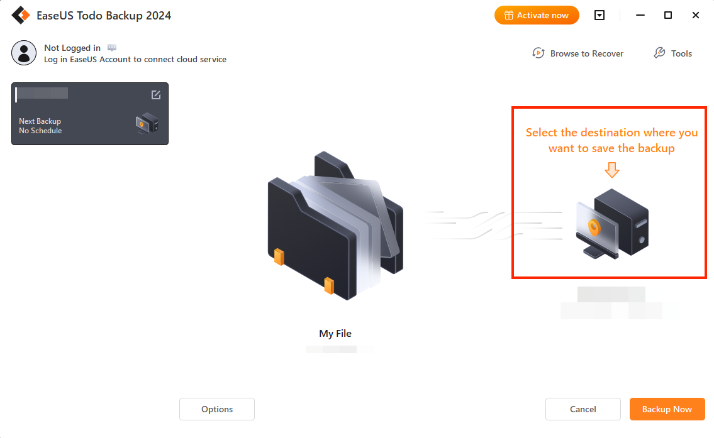
11. Click on the destination icon to set the destination of your backup.
    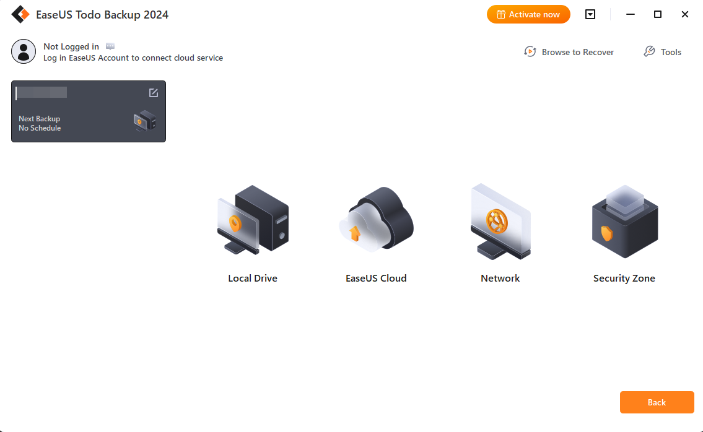
12. Click on "Local Drive" then select the backup folder you have mounted as a drive (e.g. Z: or Y:). The app will automatically recognize that it is a network storge.
    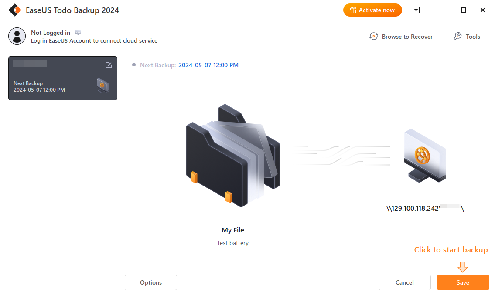
13. Click on "Save" to save your backup rule.
14. Congratulations! You're done 🎉 Check your backups later to make sure they are made regularly.

### Mac

### Linux (Ubuntu)
